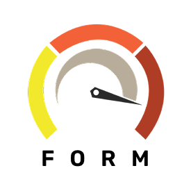

# Palapa Inspeksi - Car Inspection Form App

<p align="center">
  
</p>

<p align="center">
  <a href="https://flutter.dev">
    
  </a>
  <a href="https://github.com/CAR-dano/form-app/actions/workflows/flutter-build.yml">
    
  </a>
  <a href="https://deepwiki.com/CAR-dano/form-app">
    
  </a>
</p>

Palapa Inspeksi is a comprehensive Flutter-based mobile application designed for conducting detailed vehicle inspections. It allows inspectors to systematically capture vehicle data, assessment scores, notes, and photographs across numerous categories. The app is intended for use by "PT. Inspeksi Mobil Jogja" and is named "Palapa Inspeksi" (description: "Car-dano Palapa Form App").

## Features

The application guides inspectors through a multi-step form covering various aspects of a vehicle inspection:

* **Inspector & Customer Details:** Captures inspector information (fetched from API), customer name, inspection branch (fetched from API), and inspection date.
* **Vehicle Data:** Collects comprehensive vehicle information including make, model, year, transmission, color, odometer reading, ownership details, license plate, and tax information (1-year and 5-year expiry dates, tax cost).
* **Vehicle Checklist (Kelengkapan):** A checklist for standard vehicle items like service book, spare key, manual book, spare tire, BPKB, jack, toolkit, and verification of frame and engine numbers.
* **Inspection Summary:** Overall assessment scores for interior, exterior, chassis/legs, and engine. Includes notes for each section, indications of major issues (collision, flood, odometer reset), tire condition, and repair cost estimations.
* **Detailed Assessments:** In-depth scoring (1-10) and notes for various sub-categories:
    * Vehicle Features (Airbags, Audio System, AC, etc.)
    * Engine Condition (Vibration, Sound, Belts, Fluids, etc.)
    * Interior Condition (Steering Wheel, Pedals, Dashboard, Seats, etc.)
    * Exterior Condition (Bumpers, Lights, Panels, Glass, etc.)
    * Tires and Undercarriage (Tires, Rims, Brakes, Suspension, etc.)
    * Test Drive Performance (Steering, Transmission, Suspension, etc.)
    * Diagnostic Tools Test (Paint Thickness, AC Temperature, OBD Scanner, Battery Test, etc.)
* **Image Uploads:** Extensive photo documentation capability:
    * Mandatory and additional photos for General, Exterior, Interior, Engine, Undercarriage, and Diagnostic Tools sections.
    * Document photos (e.g., STNK, BPKB).
    * Images are processed (cropped to 4:3 aspect ratio, resized) and can be labeled by the inspector.
* **Paint Thickness Measurement:** Input fields for recording paint thickness on various car body panels.
* **Data Persistence:** Form data and image references are saved locally, allowing inspectors to resume incomplete inspections.
* **API Submission:** Completed inspection forms and associated images are submitted to a backend server.
* **User Interface:**
    * Custom-styled input fields and widgets for a tailored user experience.
    * Clear navigation (Next/Back buttons, swipeable pages) through the form steps.
    * Loading indicators during data submission.

## Tech Stack

* **Framework:** Flutter
* **State Management:** Riverpod
* **HTTP Client:** Dio (for API communication)
* **Image Handling:** image_picker, image (cropping/resizing)
* **Path Provider:** For accessing local file system for data persistence.
* **Environment Variables:** flutter_dotenv (for API configuration)
* **Unique IDs:** uuid
* **Icons & Styling:** flutter_svg, google_fonts (Rubik)
* **Launch Screen & Icons:** flutter_native_splash, flutter_launcher_icons

## Project Structure

The project follows a standard Flutter project structure, with key logic organized as follows:

* `lib/`
    * `main.dart`: App entry point and `MaterialApp` configuration.
    * `models/`: Contains data model classes (e.g., `FormData`, `ImageData`, `TambahanImageData`, `InspectorData`, `InspectionBranch`).
    * `pages/`: Contains widgets for each screen/page of the multi-step form (e.g., `page_one.dart`, `multi_step_form_screen.dart`).
    * `providers/`: Holds Riverpod providers for state management (e.g., `form_provider.dart`, `image_data_provider.dart`).
    * `services/`: Includes services like `api_service.dart` for backend communication.
    * `statics/`: Stores static assets like styles (`app_styles.dart`).
    * `widgets/`: Contains reusable custom UI components (e.g., `labeled_text_field.dart`, `navigation_button_row.dart`).
    * `formatters/`: Custom input formatters (e.g., `thousands_separator_input_formatter.dart`, `bullet_list_input_formatter.dart`).
* `assets/`
    * `images/`: Contains static image assets, including the app icon (`icon.png`).
    * `.env`: (Gitignored) For environment variables like API base URL.
* `test/`: Contains widget tests (e.g., `widget_test.dart`).

## Getting Started

This project is a standard Flutter application.

1.  **Clone the repository:**
    ```bash
    git clone <repository-url>
    cd form_app
    ```
2.  **Set up Flutter:** Ensure you have Flutter SDK installed. For more information, view the [online documentation](https://docs.flutter.dev/).
3.  **Create Environment File:**
    Create a `.env` file in the root of the project (same level as `pubspec.yaml`) with the following content:
    ```env
    API_BASE_URL=your_actual_api_base_url_here
    ```
    Replace `your_actual_api_base_url_here` with the base URL of the backend API.
4.  **Install dependencies:**
    ```bash
    flutter pub get
    ```
5.  **Run the application:**
    ```bash
    flutter run
    ```

## Building the App

To build a release APK:
```bash
flutter build apk --release --build-name=<version_from_pubspec> --build-number=<build_number>
